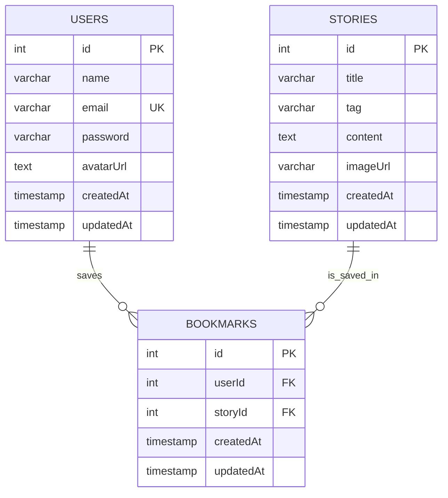

# Relatório Técnico — Filosofia em Perspectiva

## 1. Identificação e Casos de Uso

### Descrição da Aplicação
"Filosofia em Perspectiva" é uma aplicação web que conecta sabedoria filosófica a desafios cotidianos, permitindo que usuários acessem histórias e reflexões.

### Atores
- **Visitante**: usuário que acessa a aplicação mas não possui conta ou não realizou login.
- **Usuário Cadastrado (Membro Explorador)**: usuário que possui cadastro e está autenticado na plataforma.

### Casos de Uso (Descritivo)

### UC01 — Registrar Usuário
- Ator Principal: Visitante  
- Descrição: Permite que um visitante crie uma conta no sistema fornecendo nome, e-mail e senha.  
- Fluxo Principal:
  1. O visitante acessa a tela de registro.
  2. Informa nome, e-mail e senha.
  3. O sistema valida se o e-mail já existe.
  4. O sistema cria o registo e criptografa a senha.
- Requisito Técnico: `POST /auth/register`

### UC02 — Realizar Login (Autenticação)
- Ator Principal: Visitante  
- Descrição: Permite ao usuário obter acesso às funcionalidades restritas através de suas credenciais.  
- Fluxo Principal:
  1. O visitante informa e-mail e senha.
  2. O sistema verifica a hash da senha.
  3. O sistema retorna um Token JWT para a sessão.
- Requisito Técnico: `POST /auth/login`

### UC03 — Visualizar Perfil Próprio
- Ator Principal: Membro Explorador  
- Descrição: O usuário logado pode visualizar seus próprios dados cadastrais.  
- Pré-condição: Estar autenticado (Token JWT válido).  
- Fluxo Principal:
  1. O membro solicita ver seu perfil.
  2. O sistema recupera os dados (nome, e-mail, avatar) baseados no token.
- Requisito Técnico: `GET /auth/me`

### UC04 — Atualizar Perfil
- Ator Principal: Membro Explorador  
- Descrição: Permite ao usuário alterar seu nome de exibição ou URL do avatar.  
- Fluxo Principal:
  1. O membro edita os campos desejados.
  2. O sistema salva as alterações no banco de dados.
- Requisito Técnico: `PATCH /auth/me`

### UC05 — Alterar Senha
- Ator Principal: Membro Explorador  
- Descrição: Permite a troca de senha por motivos de segurança.  
- Fluxo Principal:
  1. O membro fornece o e-mail, a senha atual e a nova senha.
  2. O sistema valida a senha antiga.
  3. O sistema atualiza a senha criptografada.
- Requisito Técnico: `PUT /auth/change-password`

### UC06 — Listar Histórias e Reflexões
- Ator Principal: Visitante ou Membro  
- Descrição: Apresenta o catálogo (feed) de todas as histórias filosóficas disponíveis na plataforma.  
- Fluxo Principal:
  1. O usuário acessa a página "Explorar".
  2. O sistema retorna uma lista resumida (título, tag, imagem) das histórias.
- Requisito Técnico: `GET /stories`

### UC07 — Ler História Detalhada
- Ator Principal: Visitante ou Membro  
- Descrição: Permite a leitura completa do conteúdo de uma reflexão específica.  
- Fluxo Principal:
  1. O usuário seleciona um card de história.
  2. O sistema carrega o texto completo, imagem e metadados daquela história.
- Requisito Técnico: `GET /stories/:id`

### UC08 — Favoritar História
- Ator Principal: Membro Explorador  
- Descrição: Permite ao usuário salvar uma história em sua lista pessoal de favoritos para leitura posterior.  
- Fluxo Principal:
  1. O usuário seleciona a opção de favoritar em uma história.
  2. O sistema registra o vínculo entre o usuário e a história.
- Requisito Técnico: `POST /stories/favs`

### UC09 — Remover Favorito
- Ator Principal: Membro Explorador  
- Descrição: Remove uma história previamente salva da lista de favoritos.  
- Fluxo Principal:
  1. O usuário desmarca a opção de favoritar.
  2. O sistema remove o vínculo entre o usuário e a história.
- Requisito Técnico: `DELETE /stories/favs`

### UC10 — Listar Favoritos
- Ator Principal: Membro Explorador  
- Descrição: O usuário visualiza todas as histórias que ele marcou como favoritas.  
- Fluxo Principal:
  1. O usuário acessa a seção "Minhas Histórias" ou "Favoritos".
  2. O sistema retorna a lista de histórias associadas ao ID do usuário.
- Requisito Técnico: `GET /stories/favs/:userID`

## 2. Especificação da API

A API segue o padrão REST e utiliza JSON para comunicação. Autenticação via Bearer JWT.

### Endpoints — Autenticação (Auth)
| Método | Endpoint                | Descrição                                 | Autenticação |
|--------|-------------------------|-------------------------------------------|--------------|
| POST   | /auth/register          | Cria um novo usuário                      | Pública      |
| POST   | /auth/login             | Autentica e retorna um Token JWT          | Pública      |
| GET    | /auth/me                | Retorna dados do usuário logado           | Bearer Token |
| PATCH  | /auth/me                | Atualiza perfil (nome/avatar)             | Bearer Token |
| PUT    | /auth/change-password   | Altera a senha do usuário                 | Pública (body com credenciais) |

### Endpoints — Histórias (Stories)
| Método | Endpoint | Descrição | Autenticação |
|--------|----------|-----------|--------------|
| GET | /stories | Lista todas as histórias disponíveis | Pública |
| GET | /stories/:id | Busca detalhes de uma história pelo ID | Pública |
| GET | /stories/favs/:userID | Lista as histórias favoritas de um usuário específico | Pública / Token* |
| POST | /stories/favs | Salva uma história nos favoritos (Cria Bookmark) | Bearer Token |
| DELETE | /stories/favs | Remove uma história dos favoritos | Bearer Token |

### Documentação OpenAPI 3.0 (Swagger)
Para garantir a interoperabilidade e facilitar o consumo da API, a especificação foi formalizada utilizando o padrão OpenAPI 3.0 no arquivo `swagger.yaml`. O contrato da interface descreve os esquemas de dados (User, Story), os métodos de autenticação (Bearer JWT) e as respostas HTTP padronizadas.

A visualização desta documentação pode ser feita através do Swagger Editor colando o conteúdo YAML e também pelo endpoint `/api-docs` da aplicação.

---

## 3. Arquitetura do Backend

O projeto foi desenvolvido utilizando Node.js com Express e TypeScript, seguindo uma Arquitetura em Camadas (MSC - Model, Service, Controller) para garantir a separação de responsabilidades e desacoplamento:

- **Controller** (/src/controllers): responsável por receber as requisições HTTP (Request), validar a entrada básica e devolver a resposta (Response). Não contém regras de negócio complexas.
- **Service** (/src/services): contém lógica de negócio (ex.: verificação de senhas, hashing com bcryptjs, geração de tokens com jsonwebtoken). É a camada que orquestra as operações.
- **Repository** (/src/repository): camada de acesso a dados. Abstrai as chamadas diretas ao banco, facilitando a manutenção.
- **Model** (/src/models): representação das tabelas do banco de dados utilizando o ORM Sequelize. Define os esquemas e relacionamentos (ex: User, Story).

---

## 4. Modelagem de Dados

### Diagrama de Classes

Este diagrama representa a estrutura de domínio do sistema. Ele define as entidades principais (User e Story) e seus atributos, além de destacar a classe associativa Bookmark, que gerencia o relacionamento lógico de 'muitos para muitos' entre usuários e histórias.

```mermaid
classDiagram
    class User {
        +Integer id
        +String name
        +String email
        +String password
        +String avatarUrl
        +register()
        +login()
        +updateProfile()
    }

    class Story {
        +Integer id
        +String title
        +String tag
        +String content
        +String imageUrl
        +getDetails()
    }

    class Bookmark {
        +Integer id
        +Integer userId
        +Integer storyId
        +save()
        +remove()
    }

    User "1" --> "0..*" Bookmark : possui
    Story "1" --> "0..*" Bookmark : está em
````

### Diagrama de Casos de Uso

O diagrama ilustra as interações possíveis no sistema. O ator Visitante tem acesso às funcionalidades públicas (leitura e cadastro). O ator Membro (Logado) possui uma relação de herança com o Visitante, herdando suas permissões de leitura e ganhando acesso exclusivo às funcionalidades de engajamento (favoritos) e gestão de perfil.

```mermaid
graph LR
    Guest["Visitante"]
    Member["Membro (Logado)"]

    subgraph "Filosofia em Perspectiva"
        direction TB
        UC1(("Registrar-se"))
        UC2(("Fazer Login"))
        UC3(("Explorar Histórias"))
        UC4(("Ler História Detalhada"))
        UC5(("Favoritar História"))
        UC6(("Ver Favoritos"))
        UC7(("Gerenciar Perfil"))
    end

    Guest --> UC1
    Guest --> UC2
    Guest --> UC3
    Guest --> UC4

    Member --> UC3
    Member --> UC4
    Member --> UC5
    Member --> UC6
    Member --> UC7

    Member -.-> Guest
```

### Diagrama Entidade-Relacionamento

Este diagrama ilustra a estrutura física do banco de dados PostgreSQL. As tabelas estão normalizadas (3FN), utilizando a tabela intermediária BOOKMARKS com chaves estrangeiras (FK) para conectar usuários e histórias, garantindo a integridade referencial e evitando redundância de dados.



## 5. Documentação de Instalação e Execução

Pré-requisitos: Docker e Docker Compose.

Passo a Passo:

1. Clone o repositório e acesse a pasta:


```bash
git clone <url-do-repo>
cd filosofia-em-perspectiva
```

2. Execute o Docker Compose:

Este comando subirá o container do PostgreSQL, a API (Backend) e o Cliente (Frontend), além do Adminer para gerenciar o banco.

```bash
docker compose up --build
```

3. Acessar a Aplicação:

- Frontend: Acesse http://localhost:3000 no navegador.

- Backend (API): Rodando em http://localhost:8000.

- Adminer (Banco de Dados): Acesse http://localhost:8888 (Sistema: PostgreSQL, Servidor: postgres, Usuário: postgres, Senha: postgres, Banco: pbe).

4. Populando o Banco (Seed): 

O backend está configurado para rodar um "seed" automático ao iniciar (src/db/seeder.ts), preenchendo o banco com histórias iniciais definidas em stories.json.

## 6. Checklist de Verificação

[x] Endpoints Implementados: Sim (Auth e Stories funcionais).

[x] Arquitetura em Camadas: Sim (Controller, Service, Repository implementados em src/).

[x] Banco de Dados + ORM: Sim (PostgreSQL + Sequelize).

[x] Backend Funcional: Sim (Lógica de login, cadastro e listagem implementada).

[x] Documentação de Execução: Sim (Item 5 acima).

[x] Casos de Uso e API: Sim (Itens 1 e 2 acima).

[x] Diagramas: Sim (Item 4 acima).
